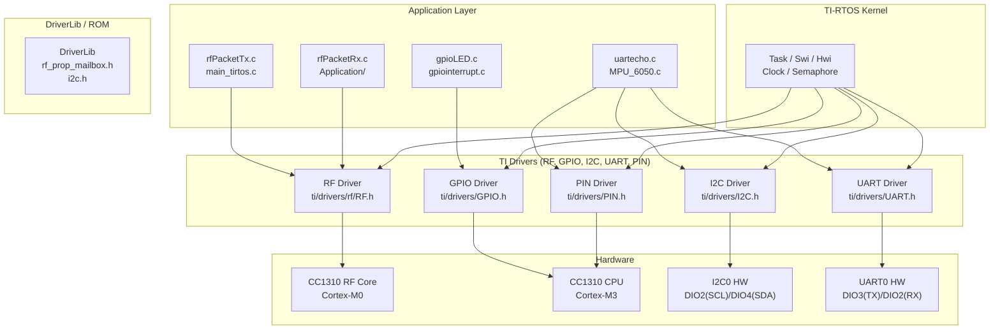
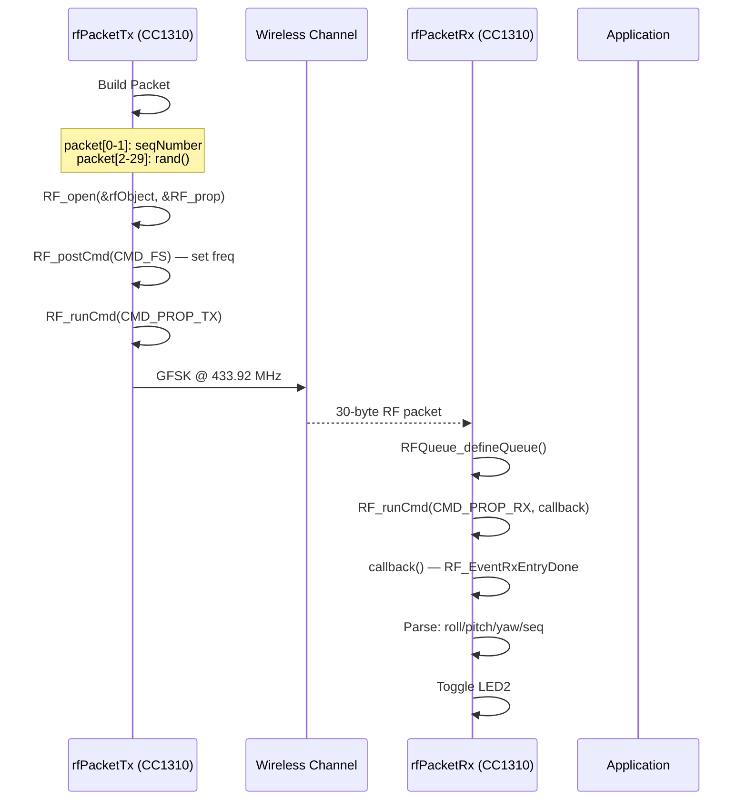
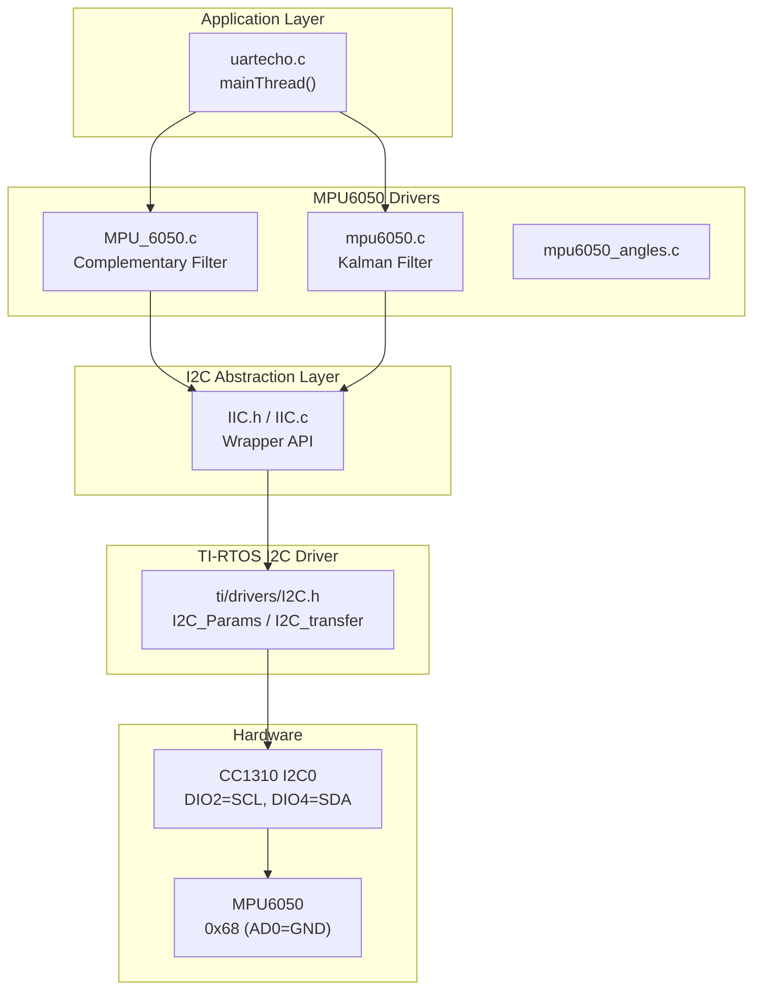
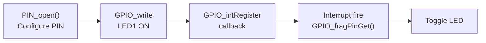
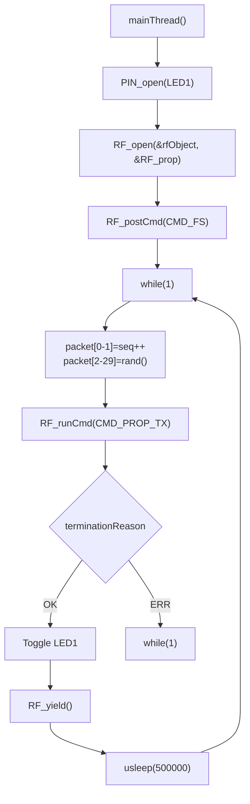
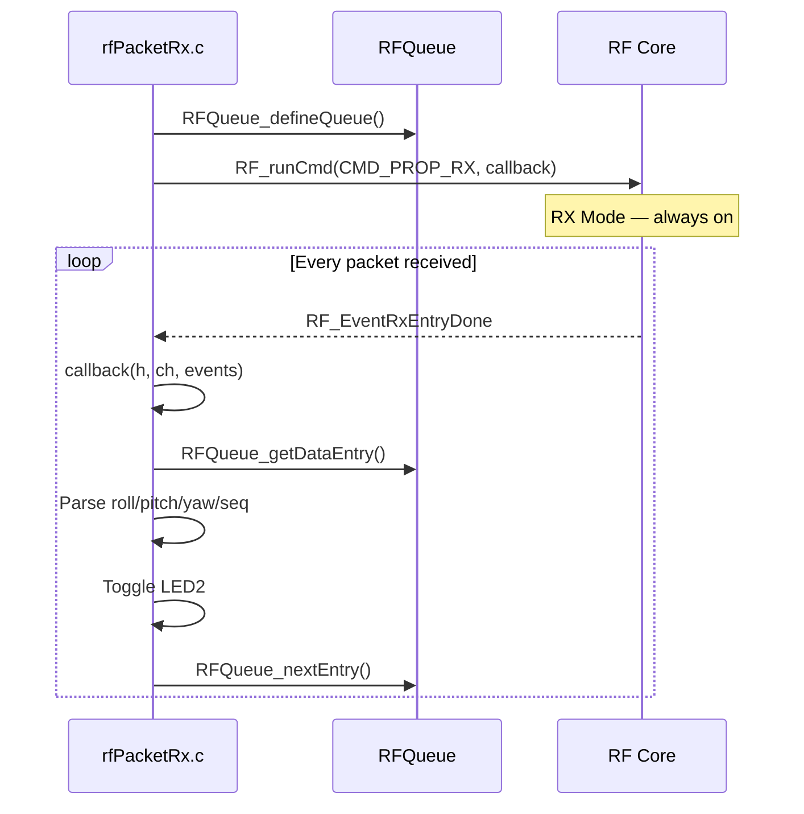
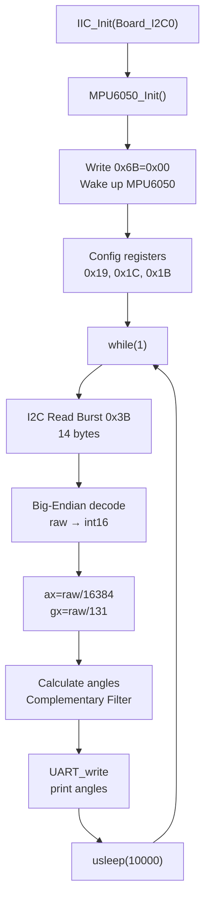

# CC1310-module

> **Dự án phát triển firmware trên module RF CC1310 – Texas Instruments**
> Đồng thời tích hợp cảm biến IMU MPU6050 qua giao tiếp I2C

---

## Mục lục

1. [Tổng quan](#1-tổng-quan)
2. [Kiến trúc hệ thống](#2-kiến-trúc-hệ-thống)
3. [Cấu trúc thư mục](#3-cấu-trúc-thư-mục)
4. [Các module firmware](#4-các-module-firmware)
5. [Thông số RF – SmartRF](#5-thông-số-rf--smartrf)
6. [Tích hợp MPU6050 (I2C)](#6-tích-hợp-mpu6050-i2c)
7. [Hướng dẫn build & nạp](#7-hướng-dẫn-build--nạp)
8. [Phần cứng](#8-phần-cứng)

---

## 1. Tổng quan

Dự án gồm **4 module firmware** độc lập, chạy trên **CC1310 LaunchPad (CC1310_LAUNCHXL)** — một vi điều khiển sub-1 GHz của Texas Instruments với:

| Thông số | Giá trị |
|----------|---------|
| MCU Core | ARM Cortex-M3 |
| Tần số vô tuyến | 433.92 MHz (Sub-1 GHz) |
| Protocol | Proprietary GFSK |
| Data rate | 50 kBaud |
| Tx Power | +15 dBm |
| RTOS | TI-RTOS / FreeRTOS |

### Các module

| Module | Chức năng |
|--------|-----------|
| `gpioLED` | Điều khiển LED & GPIO Interrupt |
| `rfPacketTx` | Phát gói tin RF (TX) |
| `rfPacketRx` | Nhận gói tin RF (RX) |
| `uartecho` | Giao tiếp I2C với MPU6050 + UART echo |

---

## 2. Kiến trúc hệ thống

### 2.1 Sơ đồ kiến trúc phần mềm



### 2.2 Sơ đồ luồng dữ liệu RF (TX → RX)



### 2.3 Sơ đồ kiến trúc I2C – MPU6050



---

## 3. Cấu trúc thư mục

```
CC1310-module/
│
├── gpioLED/                      # Module 1: GPIO & LED control
│   ├── main_tirtos.c             # Entry point
│   ├── gpiointerrupt.c           # GPIO interrupt handler
│   ├── CC1310_LAUNCHXL.c/.h      # Board pin mapping
│   └── .cproject                  # CCS project file
│
├── rfPacketTx/                   # Module 2: RF Transmitter
│   ├── main_tirtos.c             # Entry point
│   ├── rfPacketTx.c              # TX logic + packet build
│   ├── smartrf_settings/         # SmartRF Studio generated
│   │   ├── smartrf_settings.c
│   │   └── smartrf_settings.h
│   └── .cproject
│
├── rfPacketRx/                   # Module 3: RF Receiver
│   ├── main_tirtos.c             # Entry point
│   ├── Application/
│   │   └── rfPacketRx.c          # RX logic + callback
│   ├── Drivers/RF/
│   │   ├── RFQueue.h             # Ring buffer for RX packets
│   │   └── RFQueue.c
│   ├── Config/
│   │   └── Board.h               # Board-level definitions
│   ├── Startup/
│   │   ├── CC1310_LAUNCHXL.c     # Device initialization
│   │   └── CC1310_LAUNCHXL_TIRTOS.cmd
│   └── smartrf_settings/
│
├── uartecho/                     # Module 4: I2C MPU6050 + UART
│   ├── Application/
│   │   └── uartecho.c            # Main application
│   ├── Drivers/
│   │   ├── IIC.h / IIC.c         # I2C wrapper
│   │   ├── MPU_6050.h / .c       # MPU6050 driver (Complementary)
│   │   └── mpu6050/              # Kalman alternative driver
│   │       ├── mpu6050.h
│   │       ├── mpu6050.c
│   │       ├── mpu6050_angles.h
│   │       └── mpu6050_angles.c
│   ├── Config/
│   │   └── Board.h
│   ├── Middleware/
│   ├── Startup/
│   └── smartrf_settings/
│
├── smartrf_settings.h            # Shared RF config declarations
├── smartrf_settings.c             # Shared RF config (root — dùng chung)
└── README.md                      # (this file)
```

---

## 4. Các module firmware

### 4.1 `gpioLED` — GPIO & Interrupt

**Chức năng:** Điều khiển LED trên LaunchPad và xử lý ngắt GPIO.

**Luồng thực thi:**



**Các file quan trọng:**

| File | Mô tả |
|------|-------|
| `gpiointerrupt.c` | Đăng ký & xử lý GPIO callback |
| `main_tirtos.c` | Khởi tạo Board, tạo task |
| `CC1310_LAUNCHXL.c` | Định nghĩa `Board_PIN_LED1`, `Board_BTN1` |

---

### 4.2 `rfPacketTx` — RF Transmitter

**Chức năng:** Phát gói tin không dây liên tục qua sóng RF ở tần số **433.92 MHz**.

**Cấu trúc gói tin (30 bytes):**

```
┌──────────────┬───────────────┬──────────────────┐
│ Bytes 0–1    │ Bytes 2–29    │ Interval         │
│ Sequence #   │ Random payload│ 500 ms (default) │
│ (uint16, BE) │ rand() values │                  │
└──────────────┴───────────────┴──────────────────┘
```

**Luồng TX:**



**Thông số chính:**

```c
PAYLOAD_LENGTH    = 30
PACKET_INTERVAL   = 500000 µs  // 500 ms
TX Power          = +15 dBm
Frequency         = 433.92032 MHz
Data Rate         = 50 kBaud
Sync Word         = 32 bits
```

---

### 4.3 `rfPacketRx` — RF Receiver

**Chức năng:** Nhận gói tin RF, parse dữ liệu góc (roll/pitch/yaw) từ cảm biến MPU6050, hiển thị qua LED.

**Cấu trúc packet nhận được (≥ 14 bytes):**

```
┌──────────┬──────────┬──────────┬──────────┐
│ Bytes 0-3│ Bytes 4-7│ Bytes 8-11│ Bytes 12-13│
│ roll     │ pitch    │ yaw      │ seq#      │
│ (float)  │ (float)  │ (float)  │ (uint16)  │
└──────────┴──────────┴──────────┴──────────┘
```

**Luồng RX có callback:**



**Cấu trúc buffer nhận (2-entry ring buffer):**

```c
DATA_ENTRY_HEADER_SIZE = 8
NUM_DATA_ENTRIES      = 2
MAX_LENGTH             = 30
NUM_APPENDED_BYTES     = 2   // status byte
// rxDataEntryBuffer[RF_QUEUE_DATA_ENTRY_BUFFER_SIZE(2, 30, 2)]
```

---

### 4.4 `uartecho` — I2C MPU6050 + UART

**Chức năng:** Giao tiếp I2C với cảm biến MPU6050 (IMU 6-DOF), đọc gia tốc + con quay, tính góc roll/pitch/yaw, in qua UART.

**Hai driver song song:**

| Driver | Filter | File | Ưu điểm |
|--------|--------|------|---------|
| Complementary Filter | α = 0.98 | `MPU_6050.c` | Nhẹ, đơn giản |
| Kalman Filter | Kalman 1D | `mpu6050/mpu6050.c` | Chính xác hơn |

**Luồng đọc MPU6050:**



**Các thanh ghi quan trọng của MPU6050:**

| Thanh ghi | Địa chỉ | Giá trị | Mô tả |
|-----------|---------|---------|-------|
| WHO_AM_I | 0x75 | 0x68 | Device ID |
| PWR_MGMT_1 | 0x6B | 0x00 | Wake up |
| SMPLRT_DIV | 0x19 | 0x07 | Sample rate = 1kHz/(1+7) |
| ACCEL_CONFIG | 0x1C | 0x00 | ±2g |
| GYRO_CONFIG | 0x1B | 0x00 | ±250°/s |
| ACCEL_XOUT_H | 0x3B | — | Burst read start |

---

## 5. Thông số RF – SmartRF

> Generated by **SmartRF Studio v2.32.0** | Device: **CC1310 Rev. B (2.1)**

| Thông số | Giá trị |
|----------|---------|
| Frequency | **433.92032 MHz** |
| Protocol | Proprietary Sub-1 GHz (GFSK) |
| Data Rate | 50.000 kBaud |
| Deviation | 25.000 kHz |
| RX Filter BW | 98.0 kHz |
| TX Power | **+15 dBm** *(yêu cầu `CCFG_FORCE_VDDR_HH = 1`)* |
| Sync Word | 32 bits |
| Packet Length | Variable, max 255 |
| Whitening | No |
| Modulation | 2-GFSK |
| Address Mode | No address check |

**RF Commands được sử dụng:**

```c
extern RF_Mode                     RF_prop;
extern rfc_CMD_PROP_RADIO_DIV_SETUP_t RF_cmdPropRadioDivSetup;
extern rfc_CMD_FS_t                RF_cmdFs;
extern rfc_CMD_PROP_TX_t           RF_cmdPropTx;
extern rfc_CMD_PROP_RX_t           RF_cmdPropRx;
extern uint32_t                    pOverrides[];  // Synth, PA, calibration
```

---

## 6. Tích hợp MPU6050 (I2C)

### 6.1 Sơ đồ kết nối phần cứng

```
┌─────────────────────────────────┐         ┌──────────────────┐
│     CC1310 LaunchPad            │         │    MPU6050       │
│                                 │         │                  │
│  DIO2  ────────────────────────┼────────►│  SCL             │
│  DIO4  ────────────────────────┼────────►│  SDA             │
│  3V3   ────────────────────────┼────────►│  VCC             │
│  GND   ────────────────────────┼────────►│  GND             │
│                                 │         │  AD0 ──────► GND │
│  DIO3  ────────────────────────┼────────►│  TX (UART debug) │
└─────────────────────────────────┘         └──────────────────┘

MPU6050 I2C Address: 0x68 (AD0 = GND)
```

### 6.2 I2C Wrapper API (`IIC.h`)

```c
// Singleton pattern — gọi 1 lần khi khởi tạo
bool IIC_Init(uint_least8_t index);                    // I2C_open()

// Đọc 1 thanh ghi
uint8_t I2C_Read_Register(uint8_t slaveAddr,
                           uint8_t reg);

// Ghi 1 thanh ghi
bool I2C_Write_Register(uint8_t slaveAddr,
                         uint8_t reg, uint8_t data);

// Burst read nhiều bytes
bool I2C_Read_Burst(uint8_t slaveAddr, uint8_t reg,
                    uint8_t *buf, uint8_t len);
```

### 6.3 Complementary Filter

```c
// Công thức (MPU_6050.c)
s_roll  = COMP_ALPHA * (s_roll  + gx * dt) + (1.0f - COMP_ALPHA) * roll_acc;
s_pitch = COMP_ALPHA * (s_pitch + gy * dt) + (1.0f - COMP_ALPHA) * pitch_acc;
s_yaw   = s_yaw + gz * dt;  // Tích phân gyro Z (yaw drift)

#define COMP_ALPHA  0.98f
#define ACCEL_SCALE_2G    16384.0f   // LSB/g
#define GYRO_SCALE_250DPS  131.0f    // LSB/°/s
```

### 6.4 Kalman Filter Parameters

```c
typedef struct {
    double Q_angle;    // 0.001 — process noise
    double Q_bias;     // 0.003 — gyro bias noise
    double R_measure;  // 0.03  — measurement noise
    double angle;      // estimated angle
    double bias;       // estimated gyro bias
    double P[2][2];   // error covariance
} Kalman_t;
```

---

## 7. Hướng dẫn build & nạp

### Yêu cầu

- **Code Composer Studio (CCS)** v10.x trở lên
- **TI CC13x0 SDK** v2.10.xx.xx trở lên
- **XDC Tools**
- **GCC ARM Embedded Toolchain** (nếu dùng GCC)

### Các bước build

```bash
# 1. Mở CCS → Import Project
# File → Import → CCS Projects → Browse đến thư mục module
# Ví dụ: E:/DATN/CC1310-module/rfPacketTx

# 2. Chọn target: CC1310_LAUNCHXL

# 3. Build
# Project → Build Project
# Hoặc Ctrl+B

# 4. Nạp & debug
# Run → Debug (F11)
```

### Nạp qua Command Line (ccs)

```bash
# Xác định project config
export CCS_PATH="C:/ti/ccs"
export SDK_PATH="C:/ti/simplelink_cc13x0_sdk"

# Gọi loader
${SDK_PATH}/tools/ccs_loader/loadscripter \
  --device CC1310F128 \
  --algorithm ${SDK_PATH}/algorithms/rf/fsk/flexible_length/cc1310_app.hex \
  --load-executable \
  <project_name>.out
```

### Chọn module muốn build

| Module | Thư mục | CCS Project File |
|--------|---------|-----------------|
| GPIO LED Demo | `gpioLED/` | `.ccsproject` |
| RF Transmitter | `rfPacketTx/` | `.ccsproject` |
| RF Receiver | `rfPacketRx/` | `.ccsproject` |
| MPU6050 + UART | `uartecho/` | `.ccsproject` |

---

## 8. Phần cứng

### 8.1 CC1310 LaunchPad (CC1310_LAUNCHXL)

```
┌─────────────────────────────────────────┐
│           CC1310 LaunchPad              │
├─────────────────────────────────────────┤
│  LED1 (DIO_LED0)   ←── DIO0            │
│  LED2 (DIO_LED1)   ←── DIO1            │
│  BTN1 (DIO_BTN1)   ←── DIO4            │
│  BTN2 (DIO_BTN2)   ←── DIO1            │
│  UART TX           ←── DIO3            │
│  UART RX           ←── DIO2            │
│  I2C SCL           ←── DIO2            │
│  I2C SDA           ←── DIO4            │
│  RF Antenna        ───────────────────►│
└─────────────────────────────────────────┘
```

### 8.2 MPU6050 Module

| Thông số | Giá trị |
|----------|---------|
| Điện áp hoạt động | 3.3V |
| Dòng tiêu thụ | ~3.5 mA |
| Gia tốc kế | ±2g, ±4g, ±8g, ±16g |
| Con quay | ±250, ±500, ±1000, ±2000 °/s |
| Giao tiếp | I2C (400 kHz) |
| I2C Address | 0x68 (AD0=GND) / 0x69 (AD0=VCC) |

---

## License

Firmware dựa trên mẫu mã nguồn mở từ **Texas Instruments Incorporated**.
Xem chi tiết license trong header của mỗi file `.c`.
